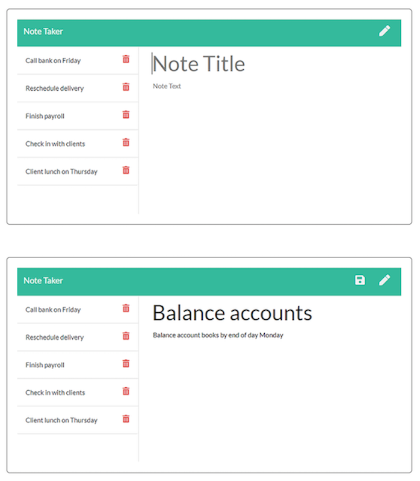

# Note Taker app

#### Table of Contents  
[Description](#description) 
[Installation Instructions](#installation-instructions) 
[Built with](#built-with-these-tools) 
[Contributions](#contributions--contact-info) 
[Screenshots/Test](#screenshots) 
[License & Copyrights](#license--copyrights) 

## Description
* An app to create and store notes.

## Installation Instructions
* Visit --> [Note Taker](https://tranquil-plateau-13378.herokuapp.com/)
* Or download repo to run locally with node

## Built with These Tools
* HTML (JavaScript generated)
* CSS
* FontAwesome
* GoogleFonts
* JavaScript (ES6)
* [Node.js](https://nodejs.org/en/)
* [Express](https://www.npmjs.com/package/express)
* [Heroku](https://www.heroku.com/home)
* [Insomnia](https://insomnia.rest/)
* [Nodemon](https://www.npmjs.com/package/nodemon)

## Contributions & Contact Info
W Rowland => find me on [GitHub](https://github.com/rolanduwxcc) or email me at rolanduwxcc@gmail.com
  
## Screenshots

## License & Copyrights
Licensed under the [MIT License]('./LICENSE')
©️2021 rolanduwxcc, Inc